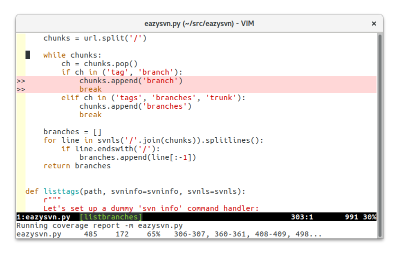

coverage-highlight.vim
----------------------

Vim plugin to highlight source code lines that lack test coverage.

Currently supports only these Python coverage tracking tools:

- `coverage.py <https://coverage.readthedocs.io/>`_
- `trace.py <https://docs.python.org/2/library/trace.html>`_ (obsolete)

Usage
-----

1. Generate some coverage data (a ``.coverage`` file) by running your tests
   with ``coverage run`` (or by using the appropriate test runner plugin).

2. Open a source file in vim

3. ``:HighlightCoverage``

Commands
--------

:HighlightCoverage
    Highlight untested source code lines.

    Tries to find the corresponding coverage report by looking for
    files named ``.coverage`` here (or in parent directories).

    Also looks for looking for files named ``coverage/<module>.report``
    to support ``trace.py`` reports, which are produced by zope.testrunner
    if you specify ``--coverage=coverage``.

:HighlightCoverage NN-NN,NN-NN,NN,...
    Highlight the specified source code lines and ranges.

    The format matches that produced by ``coverage report -m``, so you
    can copy & paste the ranges to the Vim command line from a web page,
    instead of having to hunt down and download ``.coverage`` files.

:HighlightCoverage <filename>.report
    Highlight untested source code lines from a trace.py report.

    Report files are just source code files indented with the number of
    executions or '>>>>>>' for uncovered lines prepended at the left
    margin.

:HighlightCoverageForAll
    Highlight untested source lines for all files mentioned in the coverage
    report.

    Only works with ``coverage.py`` reports.

    Skips files not currently loaded into buffers, due to a limitation of Vim.

:HighlightCoverageOff
    Turns off coverage highlighting

:NextUncovered
    Jump to the next uncovered range of source lines

:PrevUncovered
    Jump to the previous uncovered range of source lines

Settings
--------

g:coverage_script
    Default: "" (which means autodetect)

    Name of the script that can produce reports. Example::

        let g:coverage_script = 'python3 -m coverage'

    By default it looks for ``coverage`` in your PATH, and if not found,
    it looks for ``bin/coverage`` relative to the current working
    directory.

g:coverage_sign
    Default: "↣"

g:coverage_sign_branch
    Default: "↦"

g:coverage_sign_branch_target
    Default: "⇥"

    Signs used in sign_column (empty string allowed). Example::

        let g:coverage_sign = '#'
        let g:coverage_sign_branch_target = ''

Highlight groups
----------------

If you want to change the highlighting, add this to your ``.vimrc``::

  highlight NoCoverage ctermbg=... guibg=...
  highlight NoBranchCoverage ctermbg=... guibg=...
  highlight NoBranchCoverageTarget ctermbg=... guibg=...

with the colors you want.  See vim's ``:help cterm-colors`` and
``:help gui-colors`` for the color values to use.

Mappings
--------

You may want to add this to your ``.vimrc``::

  noremap [C :<C-U>PrevUncovered<CR>
  noremap ]C :<C-U>NextUncovered<CR>

Status line
-----------

Add ``%{coverage_highlight#get_current()}`` to your 'statusline' to show the
coverage percentage for the current file, updated when you run
``:HighlightCoverage``.

Add ``%{coverage_highlight#get_total()}`` to your 'statusline' to show the
coverage percentage for the current project, updated when you run
``:HighlightCoverageForAll``.

You can pass a format string to either function to customize how the coverage
is to be displayed.  The default is "%s%%".

Example ::

  set statusline=%<%f\ %h%m%r\ %1*%{coverage_highlight#get_current()}%*%=%-14.(%l,%c%V%)\ %P

Requirements
------------

Vim 8.0.0251 or newer with Python or Python3 support.

Copyright
---------

``coverage-highlight.vim`` was written by Marius Gedminas <marius@gedmin.as>
and contributors.
Licence: MIT.
